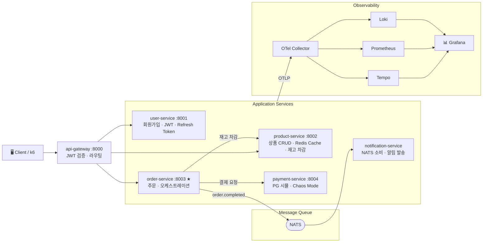

# MicroMart

> Kubernetes 기반 관찰성 스택(Prometheus, Grafana, Loki, Tempo) 학습용
> 이커머스 주문 관리 마이크로서비스 애플리케이션

---

## 구현 현황

| 서비스 | 상태 | 비고 |
| -------- | ------ | ------ |
| `user-service` | ✅ 완료 | 회원가입, 로그인, JWT RS256, Refresh Token Rotation |
| `product-service` | ✅ 완료 | 상품 CRUD, Redis Cache-Aside, 낙관적 잠금 재고 차감 |
| `order-service` | ⏳ 예정 | |
| `payment-service` | ⏳ 예정 | Chaos Mode 포함 |
| `notification-service` | ⏳ 예정 | NATS 소비 |
| `api-gateway` | ⏳ 예정 | JWT 검증 미들웨어 |
| `shared/telemetry` | ⏳ 예정 | OTel 공통 초기화 |
| Kubernetes 매니페스트 | ⏳ 예정 | |

---

## 1. 프로젝트 개요

LGTM(Loki, Grafana, Tempo, Prometheus) 관찰성 스택을 깊이 학습하기 위한 대상 애플리케이션입니다.
서비스 간 연쇄 호출, 비동기 메시지, 의도적 장애 주입(Chaos Mode)을 통해
분산 트레이싱·메트릭·로그 수집의 실제 시나리오를 경험합니다.

### 기술 스택

| 항목 | 선택 | 이유 |
|------|------|------|
| 언어 / 프레임워크 | Python 3.12 + FastAPI 0.115.x | 코드량 최소화, OpenTelemetry SDK 성숙도 높음 |
| ORM | SQLAlchemy 2.0 async | 비동기 DB 세션, Mapped 타입 안전성 |
| 설정 관리 | pydantic-settings 2.x | 환경변수 타입 검증, `.env` 파일 자동 로딩 |
| 로깅 | structlog 24.x | JSON 구조화 로그, traceId/spanId 자동 주입 |
| 데이터베이스 | PostgreSQL (서비스별 독립) | MSA 원칙 준수, 서비스 간 DB 공유 금지 |
| 캐시 | Redis (redis.asyncio 5.x) | Refresh Token 저장, product-service Cache-Aside |
| 메시지 큐 | NATS | 경량, Kubernetes 네이티브, 비동기 트레이스 전파 실습 |
| 컨테이너 | Docker | 서비스별 독립 Dockerfile |
| 오케스트레이션 | Kubernetes | 관찰성 스택 Helm 배포 환경 |
| 부하 생성 | k6 | 시나리오 스크립트, Grafana 연동 |

---

## 2. 서비스 구성

### 서비스 아키텍처



### 서비스별 상세

#### api-gateway (포트 8000)

- **역할**: 단일 진입점, RS256 JWT 로컬 검증, 라우팅, Rate Limiting, 요청/응답 로깅
- **DB**: 없음 (stateless)
- **관찰성 포인트**: 전체 inbound 메트릭, 4xx/5xx 비율, Rate Limit 발동 횟수
- **특이사항**: 검증 통과 후 `X-User-ID`, `X-User-Role` 헤더를 추가하여 하위 서비스로 전달. 하위 서비스는 JWT를 직접 검증하지 않음

#### user-service (포트 8001)

- **역할**: 회원가입, 로그인, JWT 발급(RS256), Refresh Token Rotation, token_version 관리
- **DB**: `user-db` (PostgreSQL)
- **Redis**: `refresh:user:{id}:device` 키로 기기별 Refresh Token 저장
- **관찰성 포인트**: 로그인 성공/실패 카운터(`login_total`), 신규 가입 카운터(`register_total`), 토큰 재발급 카운터(`token_refresh_total`)
- **엔드포인트**:
  - `POST /auth/register` — 회원가입
  - `POST /auth/login` — 로그인 (Access Token + Refresh Token 발급)
  - `POST /auth/refresh` — Access Token 재발급 (Refresh Token Rotation)
  - `POST /auth/logout` — 로그아웃 (기기별 Refresh Token 삭제)
  - `GET  /auth/jwks` — RS256 공개키 반환 (api-gateway 캐싱용)

#### product-service (포트 8002)

- **역할**: 상품 목록/상세 조회, 상품 등록·수정·삭제(admin), 재고 차감(order-service 전용 내부 API)
- **DB**: `product-db` (PostgreSQL) + `product-cache` (Redis, Cache-Aside 패턴)
- **낙관적 잠금**: 재고 차감 시 `version` 필드로 동시 요청 충돌 감지, `409 VERSION_CONFLICT` 반환
- **관찰성 포인트**: 캐시 히트율(`product_cache_hits_total` / `misses_total`), 재고 부족 이벤트(`product_stock_insufficient_total`), 낙관적 잠금 충돌(`product_stock_conflict_total`)
- **엔드포인트**:
  - `GET  /products` — 상품 목록 (페이지네이션, active_only 필터)
  - `GET  /products/{id}` — 상품 상세 (Cache-Aside)
  - `POST /products` — 상품 등록 (admin 전용)
  - `PUT  /products/{id}` — 상품 수정 (admin 전용, 캐시 무효화)
  - `DELETE /products/{id}` — 소프트 삭제 (admin 전용)
  - `POST /products/{id}/deduct-stock` — 재고 차감 (내부 서비스 전용, `X-Internal-Token` 인증)

#### order-service (포트 8003) ⭐ 핵심 서비스

- **역할**: 주문 생성·조회, product-service 재고 차감 호출, payment-service 결제 호출, NATS 이벤트 발행
- **DB**: `order-db` (PostgreSQL)
- **관찰성 포인트**: 주문 완료율, 주문 실패 원인 분류, 서비스 간 호출 레이턴시, 분산 트레이스 루트 스팬

#### payment-service (포트 8004)

- **역할**: 결제 승인/거절 처리 (외부 PG 시뮬레이션), Chaos Mode 내장
- **DB**: `payment-db` (PostgreSQL)
- **관찰성 포인트**: 결제 실패율, P95/P99 레이턴시, 결제 금액 히스토그램

**Chaos Mode 환경변수:**

```text
CHAOS_FAILURE_RATE=0.3 # 30% 확률로 결제 실패
CHAOS_LATENCY_MS=2000 # 결제 응답 2초 지연
CHAOS_DB_SLOWQUERY=true # DB 슬로우쿼리 시뮬레이션
```

#### notification-service

- **역할**: NATS `order.completed` 이벤트 소비, 이메일/SMS 발송 시뮬레이션
- **DB**: 없음 (로그만 기록)
- **관찰성 포인트**: 메시지 소비 레이턴시, 발송 성공/실패 카운터, 큐 적체 감지

---

## 3. 핵심 데이터 플로우 — 주문 생성

```text
Client → api-gateway POST /api/orders (JWT 포함)
api-gateway → order-service X-User-ID 헤더 + traceId 전파
order-service → product-service 재고 확인 + 차감 (낙관적 잠금)
order-service → payment-service 결제 요청 (실패 시 재고 롤백)
order-service → order-db 주문 저장
order-service → NATS order.completed 이벤트 발행
NATS → notification 이벤트 소비, 알림 발송 시뮬레이션
```

Tempo는 1~7 전 구간을 단일 트레이스로 표현하고, 각 서비스는 개별 Span으로 시각화됩니다.

---

## 4. 인증 설계

- **패턴**: Short Access Token + Refresh Token + Token Versioning
- **알고리즘**: RS256 (개인키는 user-service만 보유, 공개키는 api-gateway 캐싱)

### 토큰 구성

| 토큰 | TTL | 저장 위치 |
|------|-----|-----------|
| Access Token | 15분 | 클라이언트 메모리 또는 HttpOnly Cookie |
| Refresh Token | 7일 | Redis (서버), HttpOnly Cookie (클라이언트) |

### Redis 저장 구조

```text
refresh:user:{id}:{device} → Refresh Token 값 (기기별 세션)
user:{id}:token_version → 7 (버전 번호)
```

### 이벤트별 처리

| 이벤트 | 처리 |
|--------|------|
| 일반 로그아웃 | 해당 기기 Refresh Token 키 삭제 |
| Refresh Token 재사용 감지 | 해당 유저의 모든 세션 즉시 강제 종료 |
| 비밀번호 변경 / 강제 차단 | `token_version` +1, 모든 기기 Refresh Token 삭제 |

---

## 5. 관찰성 계측 패턴

### OpenTelemetry 초기화 (모든 서비스 공통)

```python
# 트레이싱: OTLP → OTel Collector → Tempo
# 메트릭: Prometheus Exporter (HTTP 자동 + 커스텀 비즈니스 메트릭)
# 로깅: structlog JSON 포맷 (traceId/spanId 자동 주입 → Loki)
```

### Loki 로그 필드

```json
{
  "timestamp": "2026-05-02T10:00:00Z",
  "level": "error",
  "service": "order-service",
  "trace_id": "abc123",
  "span_id": "def456",
  "user_id": "123",
  "event": "payment_failed",
  "message": "결제 서비스 응답 없음"
}
```

`trace_id` 필드로 Grafana에서 Loki 로그 → Tempo 트레이스로 바로 점프 가능합니다.

---

## 7. 관찰성 학습 시나리오

| 시나리오 | 트리거 | 관찰 방법 |
| ---------- | -------- | ----------- |
| 결제 서비스 간헐적 실패 | `CHAOS_FAILURE_RATE=0.5` | Tempo 에러 트레이스 + Loki 에러 로그 |
| 결제 서비스 지연 | `CHAOS_LATENCY_MS=3000` | Grafana P99 급등 + 알럿 발동 |
| 재고 부족 | 상품 재고 소진 | order-service 비즈니스 에러 메트릭 |
| 낙관적 잠금 충돌 | 동시 주문 요청 | `product_stock_conflict_total` 메트릭 급등 |
| DB 커넥션 풀 고갈 | product-service 부하 증가 | DB pool 메트릭 + 연쇄 에러 트레이스 |
| 알림 큐 적체 | notification-service 중단 후 재기동 | NATS 메시지 백로그 메트릭 |

---

## 8. 프로젝트 디렉토리 구조

```text
micro-mart/
├── services/
│   ├── api-gateway/
│   │   ├── app/
│   │   │   ├── main.py
│   │   │   ├── config.py
│   │   │   ├── middleware/
│   │   │   │   ├── auth.py          ← JWT 검증
│   │   │   │   └── telemetry.py     ← OTel 초기화
│   │   │   └── router.py
│   │   ├── Dockerfile
│   │   ├── .env.example
│   │   └── requirements.txt
│   ├── user-service/
│   │   ├── app/
│   │   │   ├── main.py
│   │   │   ├── config.py
│   │   │   ├── database.py          ← async_session_factory, get_db, init_db, close_db
│   │   │   ├── models.py            ← users 테이블 (token_version 포함)
│   │   │   ├── schemas.py
│   │   │   ├── auth.py              ← JWT 발급, Refresh Token Rotation
│   │   │   └── routes/
│   │   │       └── auth.py          ← 인증 엔드포인트
│   │   ├── Dockerfile
│   │   ├── .env.example
│   │   └── requirements.txt
│   ├── product-service/
│   ├── order-service/
│   ├── payment-service/
│   └── notification-service/
├── shared/
│   ├── __init__.py
│   └── telemetry/
│       ├── __init__.py
│       ├── setup.py                ← OTel 초기화 모듈
│       ├── middleware.py           ← FastAPI 요청/응답 로깅 미들웨어
│       ├── custom_logging.py       ← 구조화 로깅(Structured Logging) 설정 모듈
│       ├── test_telemetry.py       ← shared/telemetry 동작 확인 스크립트
│       └── requirements.txt        ← 필요 라이브러리
├── scripts/
│   └── generate_keys.py            ← RS256 key pair 생성
├── docker/
│   ├── init-scripts
│   │   └── init-db.sql
│   ├── docker-compose.yaml         ← 로컬 개발용
│   └── .env.example                ← 환경 변수 예시
├── k8s/
│   ├── namespaces.yaml
│   ├── api-gateway/
│   │   ├── deployment.yaml
│   │   ├── service.yaml
│   │   └── configmap.yaml
│   ├── user-service/
│   ├── product-service/
│   ├── order-service/
│   ├── payment-service/
│   ├── notification-service/
│   ├── databases/
│   │   ├── user-db.yaml
│   │   ├── product-db.yaml
│   │   ├── order-db.yaml
│   │   └── redis.yaml
│   ├── nats/
│   │   └── nats.yaml
│   └── load-generator/
│       └── k6-job.yaml
├── otel-config/
│   └── otel-collector-config.yaml
```

---

## 9. 구현 순서 (계획)

1. ✅ **공통 기반** — `shared/telemetry/`, structlog JSON 설정
2. ✅ **user-service** — JWT 발급, Refresh Token Rotation, token_version 관리
3. ✅ **product-service** — 상품 CRUD, Redis 캐싱, 낙관적 잠금 재고 차감
4. ⏳ **payment-service** — 결제 시뮬레이션, Chaos Mode 구현
5. ⏳ **order-service** — 오케스트레이터, 서비스 간 호출, NATS 발행
6. ⏳ **api-gateway** — JWT 검증 미들웨어, 리버스 프록시
7. ⏳ **notification-service** — NATS 소비, 비동기 처리
8. ⏳ **Kubernetes 매니페스트** — Deployment, Service, ConfigMap, Secret
9. ⏳ **k6 부하 스크립트** — 시나리오별 부하 생성
10. ⏳ **docker-compose.yaml** — 로컬 통합 테스트 환경
