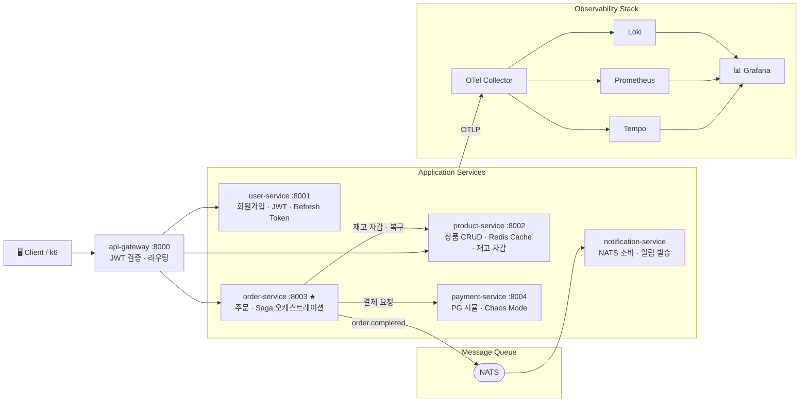

# MicroMart

> **LGTM 관찰성 스택 학습용 이커머스 마이크로서비스 애플리케이션**
> Loki · Grafana · Tempo · Prometheus를 실제 서비스 간 연쇄 호출과 장애 주입으로 경험합니다.

---

## 🗺 목차

1. [프로젝트 개요](#1-프로젝트-개요)
2. [전체 아키텍처](#2-전체-아키텍처)
3. [서비스 구성](#3-서비스-구성)
4. [핵심 플로우 — 주문 생성](#4-핵심-플로우--주문-생성)
5. [인증 설계](#5-인증-설계)
6. [관찰성 계측](#6-관찰성-계측)
7. [관찰성 학습 시나리오](#7-관찰성-학습-시나리오)
8. [기술 스택](#8-기술-스택)
9. [프로젝트 구조](#9-프로젝트-구조)
10. [구현 현황](#10-구현-현황)
11. [참조 문서](#11-참조-문서)

---

## 1. 프로젝트 개요

MicroMart는 **관찰성(Observability) 스택을 직접 경험**하기 위해 설계된 학습용 이커머스 백엔드입니다.

단순히 서비스를 배포하는 것에서 멈추지 않고, 아래 세 가지 시나리오를 통해 LGTM 스택이 실제로 어떤 데이터를 어떻게 수집하는지 체감합니다.

| 시나리오 | 목적 |
|----------|------|
| **서비스 간 연쇄 호출** | Tempo 분산 트레이싱으로 병목 구간을 추적 |
| **비동기 메시지(NATS)** | 비동기 Span 전파와 Loki 로그 상관관계 확인 |
| **Chaos Mode 장애 주입** | Prometheus 메트릭 이상 감지와 Grafana 알럿 발동 |

> **학습 목표**: 분산 시스템에서 "무슨 일이 일어나고 있는가"를 로그·메트릭·트레이스로 스스로 진단할 수 있는 역량

---

## 2. 전체 아키텍처


```mermaid
flowchart LR
    K6["🖥 Client / k6"]
    GW["api-gateway :8000\nJWT 검증 · 라우팅"]

    subgraph SERVICES["Application Services"]
        US["user-service :8001\n회원가입 · JWT · Refresh Token"]
        PS["product-service :8002\n상품 CRUD · Redis Cache · 재고 차감"]
        OS["order-service :8003 ★\n주문 · Saga 오케스트레이션"]
        PAY["payment-service :8004\nPG 시뮬 · Chaos Mode"]
        NS["notification-service\nNATS 소비 · 알림 발송"]
    end

    subgraph MQ["Message Queue"]
        NATS(["NATS"])
    end

    subgraph OBS["Observability Stack"]
        direction LR
        OTEL["OTel Collector"]
        TEMPO["Tempo"]
        PROM["Prometheus"]
        LOKI["Loki"]
        GRAF["📊 Grafana"]
    end

    K6 --> GW
    GW --> US & PS & OS

    OS -->|재고 차감 · 복구| PS
    OS -->|결제 요청| PAY
    OS -->|order.completed| NATS
    NATS --> NS

    SERVICES -- OTLP --> OTEL
    OTEL --> TEMPO & PROM & LOKI
    TEMPO & PROM & LOKI --> GRAF
```

### 핵심 설계 원칙

- **서비스별 독립 DB** — 서비스 간 물리적 FK 없음, 논리적 ID 참조만 허용
- **단일 진입점** — api-gateway가 JWT를 검증하고 `X-User-ID`, `X-User-Role` 헤더로 전달; 하위 서비스는 JWT를 직접 검증하지 않음
- **내부 API 인증** — 서비스 간 호출은 `X-Internal-Token` 헤더로 인가
- **Orchestration Saga** — order-service가 재고 차감 → 결제 → 보상(롤백) 흐름을 단계별로 DB에 기록

---

## 3. 서비스 구성

### api-gateway `포트 8000`

외부 요청의 단일 진입점. JWT를 로컬에서 검증하고 내부 서비스로 라우팅합니다.

- RS256 공개키를 user-service `/auth/jwks`에서 캐싱하여 로컬 검증
- Rate Limiting, 요청/응답 구조화 로깅
- **관찰성**: 전체 inbound 메트릭, 4xx/5xx 비율, Rate Limit 발동 횟수

---

### user-service `포트 8001`

회원가입과 JWT 인증을 담당합니다. RS256 키 쌍으로 Access Token을 발급하고, 기기별 Refresh Token Rotation을 관리합니다.

**엔드포인트**

| 메서드 | 경로 | 설명 |
|--------|------|------|
| `POST` | `/auth/register` | 회원가입 |
| `POST` | `/auth/login` | 로그인 — Access Token + Refresh Token 발급 |
| `POST` | `/auth/refresh` | Access Token 재발급 (Refresh Token Rotation) |
| `POST` | `/auth/logout` | 기기별 Refresh Token 삭제 |
| `GET`  | `/auth/jwks` | RS256 공개키 반환 (api-gateway 캐싱용) |

**Redis 키 구조**

```
refresh:user:{id}:{device}   # 정방향 키 — 기기별 세션
refresh:token:{token}        # 역방향 키 — 재사용 감지용 tombstone
user:{id}:token_version      # 강제 로그아웃 버전
```

**관찰성**: `login_total`, `register_total`, `token_refresh_total`

---

### product-service `포트 8002`

상품 CRUD와 재고 관리를 담당합니다. Cache-Aside 패턴으로 Redis를 활용하고, 낙관적 잠금으로 동시 재고 차감 충돌을 방어합니다.

**엔드포인트**

| 메서드 | 경로 | 설명 | 인증 |
|--------|------|------|------|
| `GET`  | `/products` | 상품 목록 (페이지네이션) | 공개 |
| `GET`  | `/products/{id}` | 상품 상세 (Cache-Aside) | 공개 |
| `POST` | `/products` | 상품 등록 | admin |
| `PUT`  | `/products/{id}` | 상품 수정 + 캐시 무효화 | admin |
| `DELETE` | `/products/{id}` | 소프트 삭제 | admin |
| `POST` | `/products/{id}/deduct-stock` | 재고 차감 | 내부 (`X-Internal-Token`) |
| `POST` | `/products/{id}/restore-stock` | 재고 복구 (Saga 보상) | 내부 (`X-Internal-Token`) |

**관찰성**: `product_cache_hits_total`, `product_cache_misses_total`, `product_stock_insufficient_total`, `product_stock_conflict_total`

---

### order-service `포트 8003` ⭐

프로젝트의 핵심 서비스. Orchestration Saga 패턴으로 재고 차감 → 결제 → 이벤트 발행을 조율하고, 실패 시 보상 트랜잭션을 실행합니다.

**엔드포인트**

| 메서드 | 경로 | 설명 |
|--------|------|------|
| `POST` | `/orders` | 주문 생성 (Saga 실행) |
| `GET`  | `/orders` | 내 주문 목록 (최신순) |
| `GET`  | `/orders/{id}` | 주문 상세 (items 포함) |
| `GET`  | `/health` | 헬스체크 (NATS 연결 포함) |

**Saga 상태 전이**

```
STARTED
  → STOCK_DEDUCTED       # 재고 차감 성공 시 즉시 커밋
  → PAYMENT_REQUESTED
  → COMPLETED

결제 실패 시:
  → STOCK_ROLLBACK_NEEDED  # 즉시 커밋 — 배치 복구 스캔 근거
  → STOCK_ROLLED_BACK
  → FAILED
```

> NATS `order.completed` 발행은 **best-effort** — 발행 실패 시 주문은 `COMPLETED` 유지, 로그만 기록

**관찰성**: `order_created_total`, `order_completed_total`, `order_failed_total`, `order_amount_krw`, `saga_stock_rollback_total`

---

### payment-service `포트 8004`

외부 PG(Payment Gateway)를 시뮬레이션합니다. **Chaos Mode**로 장애 상황을 의도적으로 주입하여 Grafana 알럿과 Tempo 에러 트레이스를 발생시킵니다.

**엔드포인트** (모두 `X-Internal-Token` 필수)

| 메서드 | 경로 | 설명 |
|--------|------|------|
| `POST` | `/payments` | 결제 요청 (중복 결제 이중 차단) |
| `GET`  | `/payments/{id}` | 결제 상태 조회 |
| `POST` | `/payments/{id}/refunds` | 환불 요청 (부분 환불 지원) |
| `GET`  | `/health` | 헬스체크 + Chaos 설정 상태 |

**Chaos Mode 환경변수**

```env
CHAOS_FAILURE_RATE=0.3   # 30% 확률로 결제 실패
CHAOS_LATENCY_MS=2000    # 결제 응답 2초 지연
CHAOS_DB_SLOWQUERY=true  # DB 슬로우쿼리 시뮬레이션
```

**관찰성**: `payment_total`, `payment_approved_total`, `payment_rejected_total`, `payment_amount_krw`, `payment_processing_latency_ms`, `refund_total`

---

### notification-service

NATS `order.completed` 이벤트를 소비하여 이메일/SMS 발송을 시뮬레이션합니다. DB 없이 구조화 로그만 기록합니다.

**관찰성**: 메시지 소비 레이턴시, 발송 성공/실패 카운터, 큐 적체 감지

---

## 4. 핵심 플로우 — 주문 생성

```
Client ──POST /api/orders──▶ api-gateway (JWT 검증)
                                  │ X-User-ID 헤더 + traceId 전파
                                  ▼
                            order-service
                                  │
                    ┌─────────────┼──────────────────┐
                    │             │                  │
              ① GET /products/{id}                   │
              ② POST /products/{id}/deduct-stock      │
                (낙관적 잠금, 최대 3회 재시도)         │
                    │                                 │
                    │         ③ POST /payments        │
                    │         (결제 요청)              │
                    │                                 │
              결제 성공 ──▶ order-db 저장 (COMPLETED)  │
              결제 실패 ──▶ POST /products/{id}/restore-stock
                           order-db 저장 (FAILED)     │
                    │                                 │
              ④ NATS order.completed 발행 (best-effort)
                    │
                    ▼
            notification-service (알림 시뮬레이션)
```

Tempo는 전 구간을 단일 트레이스로 표현하고, 각 서비스는 개별 Span으로 시각화됩니다.
`trace_id` 필드를 통해 Grafana에서 Loki 로그 → Tempo 트레이스로 바로 점프할 수 있습니다.

---

## 5. 인증 설계

**패턴**: Short Access Token + Refresh Token + Token Versioning
**알고리즘**: RS256 (개인키는 user-service만 보유)

| 토큰 | TTL | 저장 위치 |
|------|-----|-----------|
| Access Token | 15분 | 클라이언트 메모리 / HttpOnly Cookie |
| Refresh Token | 7일 | Redis (서버) + HttpOnly Cookie (클라이언트) |

**이벤트별 처리**

| 이벤트 | 처리 |
|--------|------|
| 일반 로그아웃 | 해당 기기 Refresh Token 삭제 |
| Refresh Token 재사용 감지 | 모든 기기 세션 즉시 강제 종료 |
| 비밀번호 변경 / 강제 차단 | `token_version` +1, 전 기기 Refresh Token 삭제 |

---

## 6. 관찰성 계측

모든 서비스는 `shared/telemetry` 공통 모듈로 OTel을 초기화합니다.

```
트레이싱  OTLP ──▶ OTel Collector ──▶ Tempo
메트릭    Prometheus Exporter (자동 HTTP 계측 + 커스텀 비즈니스 메트릭)
로깅      structlog JSON ──▶ Loki (traceId/spanId 자동 주입)
```

**구조화 로그 예시**

```json
{
  "timestamp": "2026-05-05T10:00:00Z",
  "level": "error",
  "service": "order-service",
  "trace_id": "abc123",
  "span_id": "def456",
  "user_id": "123",
  "event": "payment_failed",
  "message": "결제 서비스 응답 없음"
}
```

---

## 7. 관찰성 학습 시나리오

| 시나리오 | 트리거 | 관찰 포인트 |
|----------|--------|-------------|
| 결제 간헐적 실패 | `CHAOS_FAILURE_RATE=0.5` | Tempo 에러 트레이스 + Loki 에러 로그 |
| 결제 응답 지연 | `CHAOS_LATENCY_MS=3000` | Grafana P99 급등 + 알럿 발동 |
| 재고 부족 | 상품 재고 소진 | `order_failed_total{reason="insufficient_stock"}` |
| 낙관적 잠금 충돌 | 동시 주문 요청 | `product_stock_conflict_total` 급등 |
| DB 커넥션 풀 고갈 | product-service 고부하 | DB pool 메트릭 + 연쇄 에러 트레이스 |
| 알림 큐 적체 | notification-service 중단 후 재기동 | NATS 메시지 백로그 메트릭 |
| Saga 보상 트랜잭션 | 결제 거절 발생 | `saga_stock_rollback_total` + Tempo 롤백 Span |

---

## 8. 기술 스택

| 항목 | 선택 | 이유 |
|------|------|------|
| 언어 / 프레임워크 | Python 3.12 + FastAPI 0.115.x | 코드량 최소화, OpenTelemetry SDK 성숙도 |
| ORM | SQLAlchemy 2.0 async | 비동기 DB 세션, Mapped 타입 안전성 |
| 설정 관리 | pydantic-settings 2.x | 환경변수 타입 검증, `.env` 자동 로딩 |
| 로깅 | structlog 24.x | JSON 구조화 로그, traceId/spanId 자동 주입 |
| 데이터베이스 | PostgreSQL (서비스별 독립) | MSA 원칙, 서비스 간 DB 공유 금지 |
| 캐시 | Redis (redis.asyncio 5.x) | Refresh Token 저장, Cache-Aside 패턴 |
| 메시지 큐 | NATS | 경량, Kubernetes 네이티브, 비동기 트레이스 전파 |
| 컨테이너 | Docker | 서비스별 독립 Dockerfile |
| 오케스트레이션 | Kubernetes | 관찰성 스택 Helm 배포 환경 |
| 부하 생성 | k6 | 시나리오 스크립트, Grafana 연동 |

---

## 9. 프로젝트 구조

```text
micro-mart/
├── services/
│   ├── api-gateway/              # 단일 진입점, JWT 검증, 라우팅
│   │   └── app/
│   │       ├── main.py
│   │       ├── config.py
│   │       ├── router.py
│   │       └── middleware/
│   │           ├── auth.py       # RS256 JWT 검증
│   │           └── telemetry.py
│   ├── user-service/             # 회원가입, JWT 발급, Refresh Token
│   │   └── app/
│   │       ├── main.py
│   │       ├── config.py
│   │       ├── database.py
│   │       ├── models.py
│   │       ├── schemas.py
│   │       ├── auth.py
│   │       └── routes/auth.py
│   ├── product-service/          # 상품 CRUD, Redis 캐시, 재고 관리
│   │   └── app/
│   │       ├── main.py
│   │       ├── config.py
│   │       ├── database.py
│   │       ├── models.py
│   │       ├── schemas.py
│   │       ├── cache.py          # Cache-Aside 헬퍼
│   │       └── routes/products.py
│   ├── order-service/            # Saga 오케스트레이터 ★
│   │   └── app/
│   │       ├── main.py
│   │       ├── config.py
│   │       ├── database.py
│   │       ├── models.py
│   │       ├── schemas.py
│   │       ├── dependencies.py
│   │       ├── nats_client.py    # NATS 싱글턴 커넥션
│   │       ├── routes/orders.py
│   │       └── services/
│   │           ├── http_clients.py    # product/payment HTTP 클라이언트
│   │           └── order_service.py  # Saga 비즈니스 로직
│   ├── payment-service/          # 결제 시뮬레이션, Chaos Mode
│   │   └── app/
│   │       ├── main.py
│   │       ├── config.py
│   │       ├── database.py
│   │       ├── models.py
│   │       ├── schemas.py
│   │       ├── dependencies.py
│   │       └── routes/payments.py
│   └── notification-service/     # NATS 소비, 알림 시뮬레이션
├── shared/
│   └── telemetry/                # OTel 공통 초기화 모듈
│       ├── setup.py              # Tracer, Meter, Logger Provider 설정
│       ├── middleware.py         # FastAPI 요청/응답 로깅 미들웨어
│       └── custom_logging.py    # structlog JSON 포맷 설정
├── scripts/
│   └── generate_keys.py         # RS256 키 쌍 생성
├── docker/
│   ├── docker-compose.yaml      # 로컬 통합 테스트 환경
│   ├── init-scripts/init-db.sql # DB 초기화 스크립트
│   └── .env.example
├── docs/
│   ├── ERD_structure.md                # 데이터 모델, 제약 조건, 상태값
│   ├── service_function_definition.md  # 엔드포인트 계약, 서비스 간 호출 흐름
│   ├── micromart_design.md             # 전체 아키텍처, 설계 의도
│   ├── dev_convention.md               # 코드 컨벤션, 파일 구조 규칙
│   └── references/                     # Phase별 구현 레퍼런스
│       ├── init-develop-environment.md
│       └── shared-telemetry-reference.md
├── pyproject.toml
└── .pre-commit-config.yaml
```

---

## 10. 구현 현황

| 서비스 / 모듈 | 상태 | 완료 내용 |
|---------------|------|-----------|
| `shared/telemetry` | ✅ 완료 | OTel 공통 초기화, structlog JSON, FastAPI 미들웨어 |
| `user-service` | ✅ 완료 | 회원가입, 로그인, JWT RS256, Refresh Token Rotation, token_version |
| `product-service` | ✅ 완료 | 상품 CRUD, Redis Cache-Aside, 낙관적 잠금 재고 차감·복구 |
| `payment-service` | ✅ 완료 | 결제 시뮬레이션, Chaos Mode, 부분 환불, 비즈니스 메트릭 |
| `order-service` | ✅ 완료 | Saga 오케스트레이션, 서비스 간 HTTP 호출, NATS 이벤트 발행 |
| `api-gateway` | ⏳ 예정 | JWT 검증 미들웨어, 리버스 프록시 |
| `notification-service` | ⏳ 예정 | NATS 소비, 비동기 처리 |
| Kubernetes 매니페스트 | ⏳ 예정 | Deployment, Service, ConfigMap, Secret |
| k6 부하 스크립트 | ⏳ 예정 | 시나리오별 부하 생성 |
| docker-compose.yaml | ⏳ 예정 | 로컬 통합 테스트 환경 |

---

## 11. 참조 문서

> `docs/` 폴더의 4개 문서를 아래 순서대로 참조하면 프로젝트 전체를 빠르게 파악할 수 있습니다.

| 문서 | 역할 |
|------|------|
| [`ERD_structure.md`](docs/ERD_structure.md) | 데이터 모델, 컬럼 제약, 상태값 기준 (최우선 참조) |
| [`service_function_definition.md`](docs/service_function_definition.md) | 서비스별 책임, 엔드포인트 계약, 호출 흐름 |
| [`micromart_design.md`](docs/micromart_design.md) | 전체 아키텍처, 설계 의도, 관찰성 시나리오 |
| [`dev_convention.md`](docs/dev_convention.md) | 코드 컨벤션, 파일 구조 템플릿, 보안·테스트 규칙 |
