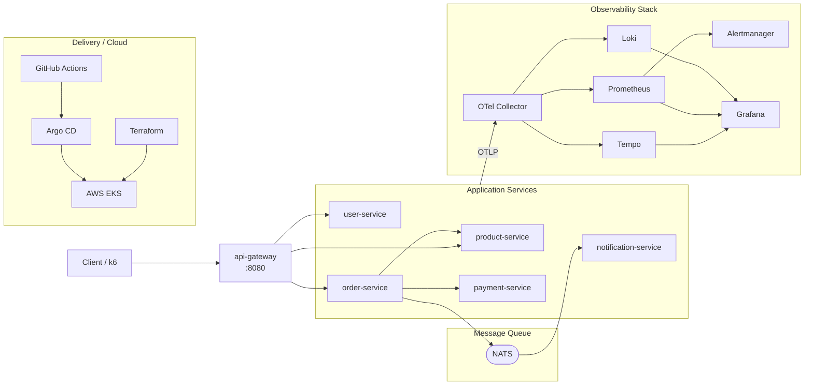

# MicroMart

> LGTM 관찰성 스택 학습용 이커머스 마이크로서비스 애플리케이션

MicroMart는 Loki, Grafana, Tempo, Prometheus를 실제 서비스 간 연쇄 호출 위에서 학습하기 위한 백엔드 프로젝트입니다.

주문 생성 흐름에서 HTTP 호출, NATS 이벤트, Chaos Mode 장애 주입을 함께 다루며 로그, 메트릭, 트레이스를 연결해 문제를 진단하는 경험을 목표로 합니다.

## 프로젝트 개요

핵심 학습 시나리오는 아래 세 가지입니다.

| 시나리오 | 학습 포인트 |
| --- | --- |
| 서비스 간 연쇄 호출 | Tempo 분산 트레이싱으로 병목과 실패 구간 추적 |
| 비동기 메시지 | NATS 이벤트 소비와 Loki 로그 상관관계 확인 |
| Chaos Mode 장애 주입 | Prometheus 메트릭 변화와 Grafana 알림 흐름 확인 |

상세한 서비스 책임, 엔드포인트 계약, 상태 전이, 데이터 모델은 `docs/` 문서를 기준으로 관리합니다.
PostgreSQL schema 변경 이력은 DB를 보유한 서비스별 Alembic migration으로 관리합니다.

## 아키텍처


```mermaid
flowchart LR
    K6["Client / k6"]
    GW["api-gateway\n:8080"]

    subgraph SERVICES["Application Services"]
        US["user-service"]
        PS["product-service"]
        OS["order-service"]
        PAY["payment-service"]
        NS["notification-service"]
    end

    subgraph MQ["Message Queue"]
        NATS(["NATS"])
    end

    subgraph OBS["Observability Stack"]
        OTEL["OTel Collector"]
        TEMPO["Tempo"]
        PROM["Prometheus"]
        ALERT["Alertmanager"]
        LOKI["Loki"]
        GRAF["Grafana"]
    end

    subgraph DELIVERY["Delivery / Cloud"]
        GHA["GitHub Actions"]
        ARGO["Argo CD"]
        TF["Terraform"]
        AWS["AWS EKS"]
    end

    K6 --> GW
    GW --> US & PS & OS
    OS --> PS
    OS --> PAY
    OS --> NATS
    NATS --> NS
    SERVICES -- OTLP --> OTEL
    OTEL --> TEMPO & PROM & LOKI
    PROM --> ALERT
    TEMPO & PROM & LOKI --> GRAF
    GHA --> ARGO
    ARGO --> AWS
    TF --> AWS
```

## 서비스 구성

| 서비스 | 역할 | 로컬 포트 | 상태 |
| --- | --- | --- | --- |
| `api-gateway` | 외부 단일 진입점, JWT 검증, 라우팅, Rate Limiting | `8000` | 완료 |
| `user-service` | 회원가입, 로그인, JWT 발급, Refresh Token 관리 | `8001` | 완료 |
| `product-service` | 상품 CRUD, Redis 캐시, 재고 차감/복구 | `8002` | 완료 |
| `order-service` | 주문 생성/조회, Saga 오케스트레이션, NATS 이벤트 발행 | `8003` | 완료 |
| `payment-service` | 결제 승인/거절 시뮬레이션, Chaos Mode, 환불 | `8004` | 완료 |
| `notification-service` | `order.completed` 이벤트 소비, 알림 발송 시뮬레이션 | 내부 | 완료 |

## DB 마이그레이션

`user-service`, `product-service`, `order-service`, `payment-service`는 각 서비스 폴더에 독립적인 Alembic 설정과 migration history를 둡니다.

## 로컬 실행

로컬 통합 실행은 Compose 파일을 역할별로 나누어 사용합니다.

```powershell
docker compose `
  -f docker/infra.yaml `
  -f docker/observability.yaml `
  -f docker/services.yaml `
  up -d
```

실행 전 서비스별 `.env` 파일과 JWT 키 파일이 필요합니다. 예시 환경변수는 `docker/.env.example` 및 각 서비스의 `.env.example`을 참고하세요.

주요 Compose 파일 역할은 다음과 같습니다.

| 파일 | 역할 |
| --- | --- |
| `docker/infra.yaml` | PostgreSQL, Redis, NATS |
| `docker/observability.yaml` | OTel Collector, Prometheus, Loki, Tempo, Grafana |
| `docker/services.yaml` | 애플리케이션 서비스 |

Kubernetes 로컬 배포는 [`k8s/README.md`](k8s/)를 참고하세요.

## 로컬 이미지 빌드 및 배포

빌드 전 REGISTRY 및 TAG 설정 필요
-> 설정하지 않을 경우 기본 REGISTRY=172.25.46.10:32000, 기본 TAG=local

예시:

```bash
REGISTRY=172.25.46.10:32000
TAG=local
```

빌드

```bash
docker compose -f docker/services.yaml build
```

배포

```bash
docker compose -f docker/services.yaml push
```

## 프로젝트 구조

```text
micro-mart/
├── services/       # api-gateway, user/product/order/payment/notification 서비스
│   └── */alembic/  # DB 보유 서비스별 Alembic migration history
├── shared/         # 공통 OpenTelemetry 및 로깅 모듈
├── docker/         # 로컬 infra, observability, service Compose 구성
├── k8s/            # Kubernetes 인프라, 관찰성, 서비스 배포 매니페스트
├── docs/           # 설계, 기능 정의, 컨벤션, reference 문서
├── requirements/   # 공통 런타임/테스트 의존성 및 constraints
├── scripts/        # PyPi 버전 확인, JWT 키 생성 등 스크립트
└── README.md
```

## 문서 안내

프로젝트를 자세히 파악하거나 구현 작업을 시작할 때는 아래 순서로 읽습니다.

| 순서 | 문서 | 역할 |
| --- | --- | --- |
| 1 | [`docs/ERD_structure.md`](docs/ERD_structure.md) | 데이터 모델, 제약 조건, 상태값 기준 |
| 2 | [`docs/service_function_definition.md`](docs/service_function_definition.md) | 서비스별 책임, 엔드포인트 계약, 서비스 간 호출 흐름 |
| 3 | [`docs/micromart_design.md`](docs/micromart_design.md) | 전체 아키텍처, 설계 의도, 관찰성 시나리오 |
| 4 | [`docs/dev_convention.md`](docs/dev_convention.md) | 코드 컨벤션, 파일 구조, 보안 및 테스트 규칙 |
| 5 | [`k8s/README.md`](k8s/README.md) | 로컬 Kubernetes 배포 흐름 |
| 6 | [`k8s/db/README.md`](k8s/db/README.md) | PostgreSQL, Redis 준비 |
| 7 | [`k8s/observability/README.md`](k8s/observability/README.md) | LGTM/OTel 배포 |

## 구현 현황

| 항목 | 상태 |
| --- | --- |
| `shared/telemetry` | 완료 |
| `user-service` | 완료 |
| `product-service` | 완료 |
| `payment-service` | 완료 |
| `order-service` | 완료 |
| `api-gateway` | 완료 |
| 로컬 통합 Compose | 완료 |
| `notification-service` | 완료 |
| Kubernetes 매니페스트 | 완료 |
| k6 부하 스크립트 | 완료 |
| 서비스별 Alembic migration | 완료 |
| Alerting 알림 | 예정 |
| CI | 예정 |
| GitOps 중심 CD | 예정 |
| AWS Cloud + Terraform | 예정 |
