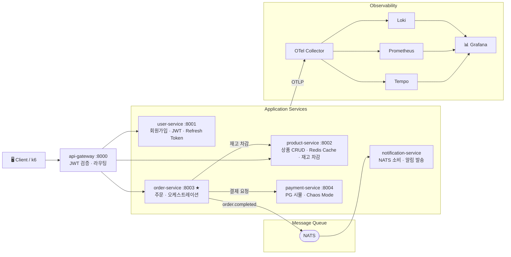

# MicroMart — 시스템 설계 문서

> Kubernetes 기반 관찰성 스택(Prometheus, Grafana, Loki, Tempo) 학습용
> 이커머스 주문 관리 마이크로서비스 애플리케이션

---

## 1. 프로젝트 개요

### 목적

LGTM(Loki, Grafana, Tempo, Prometheus) 관찰성 스택을 깊이 학습하기 위한 대상 애플리케이션이다. 서비스 간 연쇄 호출, 비동기 메시지, 의도적 장애 주입(Chaos Mode)을 통해 분산 트레이싱·메트릭·로그 수집의 실제 시나리오를 경험한다.

### 기술 스택

| 항목 | 선택 | 이유 |
| ------ | ------ | ------ |
| 언어 / 프레임워크 | Python 3.12 + FastAPI 0.115.x | 코드량 최소화, OpenTelemetry SDK 성숙도 높음 |
| ORM | SQLAlchemy 2.0 async | 비동기 DB 세션, Mapped 타입 안전성 |
| 설정 관리 | pydantic-settings 2.x | 환경변수 타입 검증, `.env` 파일 자동 로딩 |
| 로깅 | structlog 24.x | JSON 구조화 로그, traceId/spanId 자동 주입 |
| 데이터베이스 | PostgreSQL (서비스별 독립) | MSA 원칙 준수, 서비스 간 DB 공유 금지 |
| 캐시 | Redis (redis.asyncio 5.x) | Refresh Token 저장, product-service Cache-Aside |
| 메시지 큐 | NATS | 경량, Kubernetes 네이티브, 비동기 트레이스 전파 실습 |
| HTTP 클라이언트 | httpx | 비동기, OTel 자동 계측, 서비스 간 호출 및 리버스 프록시 |
| Rate Limiting | SlowAPI | IP 기반, FastAPI 통합 용이, 인메모리 저장소 |
| JWT 검증 | PyJWT + cryptography | RS256 공개키 검증, python-jose 대비 유지보수 활성화 |
| 컨테이너 | Docker | 서비스별 독립 Dockerfile |
| 오케스트레이션 | Kubernetes | 관찰성 스택 Helm 배포 환경 |
| 부하 생성 | k6 | 시나리오 스크립트, Grafana 연동 |

---

## 2. 서비스 구성

### 전체 아키텍처



### 서비스별 상세

#### api-gateway (포트 8000) ✅ 구현 완료

- **역할**: 단일 진입점, RS256 JWT 로컬 검증, 라우팅(리버스 프록시), Rate Limiting, 요청/응답 로깅, 관찰성 메트릭
- **DB**: 없음 (stateless)
- **파일 구성**:
  - `main.py` — FastAPI 앱, lifespan(JWKS 워밍업), 미들웨어 등록 순서 관리
  - `config.py` — JWKS URL, JWT 설정, Rate Limit, HTTP 타임아웃 등
  - `router.py` — catch-all 리버스 프록시, 경로 prefix 기반 라우팅
  - `middleware/auth.py` — JWKSCache 클래스, verify_jwt, is_public_path
  - `middleware/metrics.py` — OTel Counter/Histogram 메트릭 정의
  - `middleware/rate_limit.py` — SlowAPI Limiter 설정
- **미들웨어 실행 순서** (add_middleware 역순 실행):

  ```
  ① SlowAPIMiddleware    — Rate Limit 체크 (가장 먼저)
  ② AuthMiddleware       — JWT 검증, X-User-ID/Role 헤더 주입
  ③ MetricsMiddleware    — 레이턴시 측정 (인증 실패 포함 모든 요청)
  ④ RequestLoggingMiddleware — 요청/응답 구조화 로그 (가장 바깥)
  ```

- **공개 경로(인증 불필요)**:
  - `(ANY) /health` — k8s liveness probe
  - `(ANY) /auth/*` — 로그인·회원가입·토큰 재발급
  - `(GET) /products` 및 `GET /products/*` — 비인증 상품 조회
- **JWKS 캐시 설계**:
  - 최초 요청 또는 TTL 만료 시 user-service `/auth/jwks` 조회
  - 기본 TTL: 3600초 (환경변수 `JWKS_CACHE_TTL_SECONDS`로 조정)
  - kid 미매칭 시에도 JWKS 재조회 (키 로테이션 대응)
  - `asyncio.Lock`으로 동시 재조회 요청 직렬화 (thundering herd 방지)
  - 앱 시작 시 lifespan에서 캐시 워밍업 (첫 요청 레이턴시 스파이크 방지)
- **라우팅 규칙**:
  - `/auth` 또는 `/auth/*` → user-service
  - `/products` 또는 `/products/*` → product-service
  - `/orders` 또는 `/orders/*` → order-service
  - 미등록 경로 → `404 NOT_FOUND`
- **관찰성 포인트**:

| 메트릭 이름 | 타입 | 레이블 | 설명 |
| ----------- | ---- | ------ | ---- |
| `gateway_requests_total` | Counter | `method`, `path_group`, `status_code` | 전체 인바운드 요청 수 |
| `gateway_request_duration_ms` | Histogram | `method`, `path_group` | 요청 처리 레이턴시 (ms) |
| `gateway_auth_total` | Counter | `result` (success\|no_token\|failure) | JWT 검증 결과 |
| `gateway_auth_failure_total` | Counter | `reason` (expired\|invalid\|jwks_error) | JWT 검증 실패 상세 |
| `gateway_jwks_cache_total` | Counter | `result` (hit\|miss) | JWKS 캐시 히트율 |
| `gateway_rate_limit_total` | Counter | `path_group` | Rate Limit 차단 횟수 |

- **path_group 카디널리티 관리**: `/products/12345` → `/products/{id}` 로 그루핑. Prometheus 레이블에 실제 ID가 들어가면 시계열 폭발 발생.

#### user-service (포트 8001)

- **역할**: 회원가입, 로그인, JWT 발급(RS256), Refresh Token Rotation, token_version 관리
- **DB**: `user-db` (PostgreSQL)
- **Redis**:
  - `refresh:user:{id}:{device}` — 정방향 키 (user_id→token)
  - `refresh:token:{token}` — 역방향 키 (token→user_id, 재사용 감지용 tombstone)
  - `user:{id}:token_version` — 강제 로그아웃 버전 관리
- **관찰성 포인트**: 로그인 성공/실패 카운터(`login_total`), 신규 가입 카운터(`register_total`), 토큰 재발급 카운터(`token_refresh_total`)
- **엔드포인트**:
  - `POST /auth/register` — 회원가입
  - `POST /auth/login` — 로그인 (Access Token + Refresh Token 발급)
  - `POST /auth/refresh` — Access Token 재발급 (Refresh Token Rotation)
  - `POST /auth/logout` — 로그아웃 (기기별 Refresh Token 삭제)
  - `GET  /auth/jwks` — RS256 공개키 반환 (api-gateway 캐싱용)

#### product-service (포트 8002)

- **역할**: 상품 카탈로그와 재고를 담당. 공개 조회 API와 관리자용 CRUD, 그리고 `order-service`가 호출하는 내부 재고 차감/복구 API를 제공.
- **DB**: `product-db` (PostgreSQL) + `product-cache` (Redis, Cache-Aside 패턴)
- **낙관적 잠금**: 재고 차감 시 `version` 필드로 동시 요청 충돌 감지, `409 VERSION_CONFLICT` 반환
- **관찰성 포인트**: 캐시 히트율(`product_cache_hits_total` / `misses_total`), 재고 부족 이벤트(`product_stock_insufficient_total`), 낙관적 잠금 충돌(`product_stock_conflict_total`)
- **엔드포인트**:
  - `GET  /products` — 상품 목록 (페이지네이션, active_only 필터)
  - `GET  /products/{id}` — 상품 상세 (Cache-Aside)
  - `POST /products` — 상품 등록 (admin 전용)
  - `PUT  /products/{id}` — 상품 수정 (admin 전용, 캐시 무효화)
  - `DELETE /products/{id}` — 소프트 삭제 (admin 전용)
  - `POST /products/{id}/deduct-stock` — 재고 차감 (내부 서비스 전용, `X-Internal-Token` 인증)
  - `POST /products/{id}/restore-stock` — 재고 복구 보상 트랜잭션 (내부 서비스 전용, `X-Internal-Token` 인증)

#### order-service (포트 8003) ⭐ 핵심 서비스

- **역할**: 주문 생성·조회, product-service 재고 차감 호출, payment-service 결제 호출, NATS 이벤트 발행
- **DB**: `order-db` (PostgreSQL)
- **Redis**: 사용하지 않음 (Redis 설정 없음)
- **NATS**: `order.completed` 이벤트 발행 — best-effort (발행 실패 시 주문은 `COMPLETED` 유지, 로그 기록)
- **핵심 설계**: Orchestration Saga 패턴으로 단계별 상태(`saga_status`)와 보상 트랜잭션을 관리
- **ERD**: `orders`, `order_items` 테이블 사용. 상품명·단가를 주문 시점 스냅샷으로 저장
- **관찰성 포인트**:
  - `order_created_total` — 주문 생성 요청 총 횟수
  - `order_completed_total` — 주문 완료 횟수
  - `order_failed_total` — 주문 실패 횟수 (`reason` 레이블)
  - `order_amount_krw` — 주문 금액 분포 히스토그램 (원단위)
  - `saga_stock_rollback_total` — 재고 롤백 보상 트랜잭션 횟수
- **엔드포인트**:
  - `POST /orders` — 주문 생성 (Saga 오케스트레이션, `X-User-ID` 헤더)
  - `GET  /orders` — 내 주문 목록 (페이지네이션, 최신순)
  - `GET  /orders/{id}` — 주문 상세 (items 포함, IDOR 방어)
  - `GET  /health` — 헬스체크 (NATS 연결 상태 포함)
- **낙관적 잠금 재시도**: `VERSION_CONFLICT` 시 상품 재조회 후 최대 `max_optimistic_retry`(기본 3)회 재시도

#### payment-service (포트 8004)

- **역할**: 외부 PG를 흉내 내는 결제 시뮬레이터. 결제 승인/거절, 지연, 장애 주입, 환불 처리. 모든 엔드포인트는 `X-Internal-Token` 인증이 필수인 내부 전용 API.
- **DB**: `payment-db` (PostgreSQL)
- **ERD**: `payments`, `refunds` 테이블 사용. `payments.order_id`는 UNIQUE로 중복 결제 방지
- **관찰성 포인트**:
  - `payment_total` — 결제 요청 총 횟수
  - `payment_approved_total` — 결제 승인 횟수
  - `payment_rejected_total` — 결제 거절 횟수 (Chaos Mode 포함, `reason` 레이블)
  - `payment_amount_krw` — 결제 금액 분포 히스토그램 (원단위)
  - `payment_processing_latency_ms` — 결제 처리 레이턴시 히스토그램 (ms)
  - `refund_total` — 환불 요청 총 횟수
- **엔드포인트**:
  - `POST /payments` — 결제 요청 (내부 전용, 중복 결제 앱+DB 이중 차단)
  - `GET  /payments/{id}` — 결제 상태 조회 (내부 전용)
  - `POST /payments/{id}/refunds` — 환불 요청 (부분 환불 지원, 내부 전용)
- **헬스체크**: `GET /health` — Chaos Mode 설정 상태 포함 응답

**Chaos Mode 환경변수:**

```text
CHAOS_FAILURE_RATE=0.3  # 30% 확률로 결제 실패
CHAOS_LATENCY_MS=2000   # 결제 응답 2초 지연
CHAOS_DB_SLOWQUERY=true # DB 슬로우쿼리 시뮬레이션
```

#### notification-service

- **역할**: NATS `order.completed` 이벤트 소비, 이메일/SMS 발송 시뮬레이션
- **DB**: 없음 (로그만 기록)
- **관찰성 포인트**: 메시지 소비 레이턴시, 발송 성공/실패 카운터, 큐 적체 감지

---

## 3. 핵심 데이터 플로우 — 주문 생성

```text
Client → api-gateway POST /api/orders (JWT 포함)
api-gateway → (JWT 검증, Rate Limit 체크)
api-gateway → order-service X-User-ID 헤더 + traceId 전파
order-service → product-service 상품 정보 조회 (GET /products/{id})
order-service → product-service 재고 차감 (POST /products/{id}/deduct-stock, X-Internal-Token)
order-service → payment-service 결제 요청 (POST /payments, X-Internal-Token)
payment-service → order-service 결제 승인/거절 응답
order-service → 실패 시 재고 롤백 (POST /products/{id}/restore-stock), 성공 시 order-db 주문 저장
order-service → NATS order.completed 이벤트 발행 (best-effort)
NATS → notification-service 이벤트 소비, 알림 발송 시뮬레이션
```

Tempo는 전체 구간을 단일 트레이스로 표현하고, 각 서비스는 개별 Span으로 시각화된다.

### Saga 상태 전이

```text
STARTED
  → STOCK_DEDUCTED    (stock_deducted = True 커밋)
  → PAYMENT_REQUESTED
  → COMPLETED

결제 실패 시:
STARTED
  → STOCK_DEDUCTED
  → PAYMENT_REQUESTED
  → STOCK_ROLLBACK_NEEDED   (즉시 커밋 — 배치 복구 대상 스캔 근거)
  → STOCK_ROLLED_BACK       (롤백 성공)
     OR STOCK_ROLLBACK_NEEDED (롤백 실패, best-effort 유지)
  → FAILED
```

---

## 4. 인증 설계

- **패턴**: Short Access Token + Refresh Token + Token Versioning
- **알고리즘**: RS256 (개인키는 user-service만 보유, 공개키는 api-gateway 캐싱)

### 토큰 구성

| 토큰 | TTL | 저장 위치 |
| ------ | ----- | ----------- |
| Access Token | 15분 | 클라이언트 메모리 또는 HttpOnly Cookie |
| Refresh Token | 7일 | Redis (서버), HttpOnly Cookie (클라이언트) |

### Redis 저장 구조

```text
refresh:user:{id}:{device} → 정방향 키 (user_id→token), Refresh Token 값 (기기별 세션)
refresh:token:{token} → 역방향 키 (token→user_id, 재사용 감지용 tombstone)
user:{id}:token_version → 버전 번호
```

### 이벤트별 처리

| 이벤트 | 처리 |
| -------- | ------ |
| 일반 로그아웃 | 해당 기기 Refresh Token 키 삭제 |
| Refresh Token 재사용 감지 | 해당 유저의 모든 세션 즉시 강제 종료 |
| 비밀번호 변경 / 강제 차단 | `token_version` +1, 모든 기기 Refresh Token 삭제 |

### api-gateway JWT 검증 흐름

```text
1. Authorization 헤더에서 Bearer 토큰 추출
2. jwt.get_unverified_header()로 kid 추출 (네트워크 요청 없음)
3. JWKSCache.get_public_key(kid)
   ├─ 캐시 유효 + kid 존재 → 즉시 반환 (캐시 히트)
   └─ 캐시 만료 또는 kid 없음 → user-service /auth/jwks 재조회 (캐시 미스)
4. PyJWT로 서명 + 만료 검증
5. 성공: X-User-ID, X-User-Role 헤더 주입 후 하위 서비스로 전달
6. 실패: 401 반환 (reason: expired|invalid|jwks_error)
```

---

## 5. 데이터 모델 설계

상세 스키마는 `ERD_structure.md`를 기준 문서로 사용한다.

### 핵심 설계 원칙

- 서비스별 DB 분리, 서비스 간 물리적 FK 금지
- 주문 데이터는 스냅샷 저장(`product_name`, `unit_price`, `total_amount`)
- 재고 차감은 낙관적 잠금(`version`) 사용
- 결제는 `payments.order_id UNIQUE`로 멱등성 보장
- 환불은 `refunds` 테이블로 분리하여 부분 환불 확장 가능

### 주문 관련 테이블

- `orders`: 주문 헤더, 사용자 ID, 결제 ID, 주문 상태, Saga 상태, 실패 원인 저장
- `order_items`: 주문 항목, 상품 스냅샷, 할인 금액, 소계 저장

### 결제 관련 테이블

- `payments`: 결제 레코드, 승인/거절 상태, PG 트랜잭션 ID, 처리 시각 저장
- `refunds`: 환불 레코드, 부분 환불 금액, 환불 상태 저장

---

## 6. 관찰성 계측 패턴

### OpenTelemetry 초기화 (모든 서비스 공통)

```python
# 트레이싱: OTLP → OTel Collector → Tempo
# 메트릭: Prometheus Exporter (HTTP 자동 + 커스텀 비즈니스 메트릭)
# 로깅: structlog JSON 포맷 (traceId/spanId 자동 주입 → Loki)
```

### Loki 로그 필드

```json
{
  "timestamp": "2026-05-02T10:00:00Z",
  "level": "error",
  "service": "order-service",
  "trace_id": "abc123",
  "span_id": "def456",
  "user_id": "123",
  "event": "payment_failed",
  "message": "결제 서비스 응답 없음"
}
```

`trace_id` 필드로 Grafana에서 Loki 로그 → Tempo 트레이스로 바로 점프 가능하다.

---

## 7. 관찰성 학습 시나리오

| 시나리오 | 트리거 | 관찰 방법 |
| ---------- | -------- | ----------- |
| 결제 서비스 간헐적 실패 | `CHAOS_FAILURE_RATE=0.5` | Tempo 에러 트레이스 + Loki 에러 로그 |
| 결제 서비스 지연 | `CHAOS_LATENCY_MS=3000` | Grafana P99 급등 + 알럿 발동 |
| 재고 부족 | 상품 재고 소진 | order-service 비즈니스 에러 메트릭 |
| 낙관적 잠금 충돌 | 동시 주문 요청 | `product_stock_conflict_total` 메트릭 급등 |
| DB 커넥션 풀 고갈 | product-service 부하 증가 | DB pool 메트릭 + 연쇄 에러 트레이스 |
| 알림 큐 적체 | notification-service 중단 후 재기동 | NATS 메시지 백로그 메트릭 |
| Saga 보상 트랜잭션 | 결제 거절 발생 | `saga_stock_rollback_total` 증가 + Tempo 롤백 스팬 |
| Rate Limit 발동 | 고빈도 요청 | `gateway_rate_limit_total` + 429 응답율 급등 |
| JWT 위조/만료 | 잘못된 토큰 전달 | `gateway_auth_failure_total{reason="expired\|invalid"}` |
| JWKS 캐시 미스 | user-service 재기동 또는 키 로테이션 | `gateway_jwks_cache_total{result="miss"}` 증가 |

---

## 8. 프로젝트 디렉토리 구조

```text
micro-mart/
├── services/
│   ├── api-gateway/
│   │   ├── app/
│   │   │   ├── __init__.py
│   │   │   ├── main.py           # FastAPI 앱, lifespan, 미들웨어 등록 순서
│   │   │   ├── config.py         # JWKS URL, JWT 설정, Rate Limit, HTTP 타임아웃
│   │   │   ├── router.py         # catch-all 리버스 프록시, 경로 prefix 라우팅
│   │   │   └── middleware/
│   │   │       ├── __init__.py
│   │   │       ├── auth.py       # JWKSCache, verify_jwt, is_public_path
│   │   │       ├── metrics.py    # OTel 메트릭 정의 (Counter/Histogram)
│   │   │       └── rate_limit.py # SlowAPI Limiter
│   │   ├── tests/
│   │   │   ├── __init__.py
│   │   │   ├── conftest.py       # RS256 키쌍 생성, JWKS mock 헬퍼
│   │   │   ├── test_health.py
│   │   │   ├── test_auth.py      # JWT 검증, 캐시 히트/미스, 만료/위조 케이스
│   │   │   └── test_routing.py   # 경로별 라우팅, 쿼리 전달, 에러 전파
│   │   ├── .env.example
│   │   ├── pytest.ini
│   │   └── requirements.txt
│   ├── user-service/
│   │   ├── app/
│   │   │   ├── main.py
│   │   │   ├── config.py
│   │   │   ├── database.py
│   │   │   ├── models.py
│   │   │   ├── schemas.py
│   │   │   ├── auth.py
│   │   │   └── routes/
│   │   │       └── auth.py
│   │   ├── Dockerfile
│   │   ├── .env.example
│   │   └── requirements.txt
│   ├── product-service/
│   │   ├── app/
│   │   │   ├── main.py
│   │   │   ├── config.py
│   │   │   ├── database.py
│   │   │   ├── models.py
│   │   │   ├── schemas.py
│   │   │   ├── cache.py
│   │   │   └── routes/
│   │   │       └── products.py
│   │   ├── Dockerfile
│   │   ├── .env.example
│   │   └── requirements.txt
│   ├── payment-service/
│   │   ├── app/
│   │   │   ├── __init__.py
│   │   │   ├── main.py
│   │   │   ├── config.py
│   │   │   ├── database.py
│   │   │   ├── models.py
│   │   │   ├── schemas.py
│   │   │   ├── dependencies.py
│   │   │   └── routes/
│   │   │       └── payments.py
│   │   ├── tests/
│   │   │   ├── conftest.py
│   │   │   └── test_payments.py
│   │   ├── .env.example
│   │   ├── pytest.ini
│   │   └── requirements.txt
│   ├── order-service/
│   │   ├── app/
│   │   │   ├── __init__.py
│   │   │   ├── main.py
│   │   │   ├── config.py
│   │   │   ├── database.py
│   │   │   ├── models.py
│   │   │   ├── schemas.py
│   │   │   ├── dependencies.py
│   │   │   ├── nats_client.py
│   │   │   ├── routes/
│   │   │   │   └── orders.py
│   │   │   └── services/
│   │   │       ├── http_clients.py
│   │   │       └── order_service.py
│   │   ├── test/
│   │   ├── .env.example
│   │   ├── pytest.ini
│   │   └── requirements.txt
│   └── notification-service/
├── shared/
│   ├── __init__.py
│   └── telemetry/
│       ├── __init__.py
│       ├── setup.py
│       ├── middleware.py
│       ├── custom_logging.py
│       ├── test_telemetry.py
│       └── requirements.txt
├── scripts/
│   └── generate_keys.py
├── docker/
│   ├── init-scripts/
│   │   └── init-db.sql
│   ├── infra.yaml
│   └── .env.example
├── docs/
│   ├── dev_convention.md
│   ├── service_function_definition.md
│   ├── micromart_design.md
│   ├── ERD_structure.md
│   └── references/
│       ├── init-develop-environment.md
│       └── shared-telemetry-reference.md
├── pyproject.toml
├── .pre-commit-config.yaml
└── README.md
```

---

## 9. 구현 순서

1. ✅ **공통 기반** — `shared/telemetry/`, structlog JSON 설정
2. ✅ **user-service** — JWT 발급, Refresh Token Rotation, token_version 관리
3. ✅ **product-service** — 상품 CRUD, Redis 캐싱, 낙관적 잠금 재고 차감·복구
4. ✅ **payment-service** — 결제 시뮬레이션, Chaos Mode, 부분 환불 구현
5. ✅ **order-service** — 오케스트레이터, Saga 패턴, 서비스 간 호출, NATS 이벤트 발행
6. ✅ **api-gateway** — JWT 검증 미들웨어(JWKS 캐시), 리버스 프록시, Rate Limiting, 관찰성 메트릭
7. ⏳ **notification-service** — NATS 소비, 비동기 처리
8. ⏳ **Kubernetes 매니페스트** — Deployment, Service, ConfigMap, Secret
9. ⏳ **k6 부하 스크립트** — 시나리오별 부하 생성
10. ⏳ **docker-compose.yaml** — 로컬 통합 테스트 환경

---

## 10. 참조 문서

| 문서 | 역할 |
| -------------------------------- | ---------------------------- |
| `ERD_structure.md` | 최종 데이터 모델, 제약 조건, Saga 상태 전이 |
| `service_function_definition.md` | 서비스별 기능 정의, 엔드포인트 계약, 호출 흐름 |
| `dev_convention.md` | 코드 생성 컨벤션, 네이밍 규칙, 파일 구조 템플릿, 서비스 간 호출 규칙 |

> `micromart_design.md`는 프로젝트 전체 구조와 설계 의도를 설명하는 상위 문서이며, DB 스키마 상세는 `ERD_structure.md`를 기준으로 유지한다.
